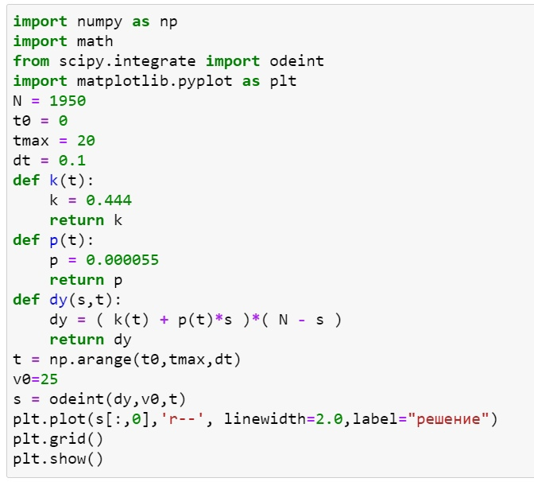
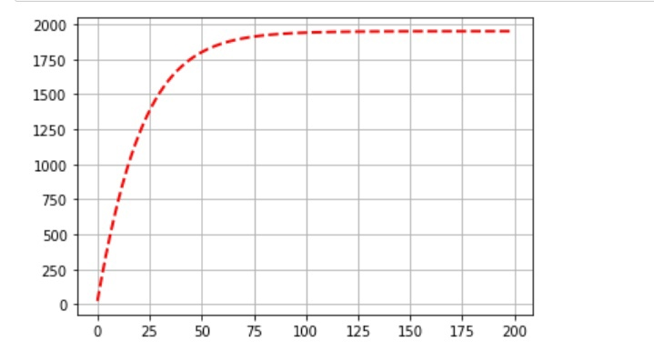
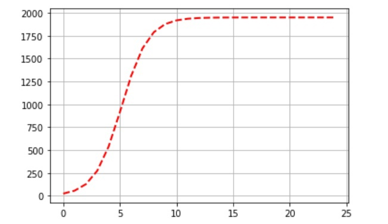
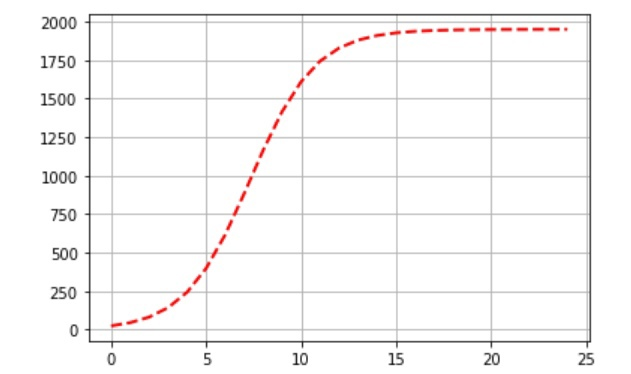

---
## Front matter
lang: ru-RU
title: Эффективность рекламы
author: Назарьева Алена НФИбд-03-18
institute:
	inst RUDN University, Moscow, Russian Federation
date: 2021, 23 march
## Formatting
toc: false
slide_level: 2
theme: metropolis
header-includes:
 - \metroset{progressbar=frametitle,sectionpage=progressbar,numbering=fraction}
 - '\makeatletter'
 - '\beamer@ignorenonframefalse'
 - '\makeatother'
aspectratio: 43
section-titles: true
---
# Цель работы

Изучить и реализовать Эффективность рекламы

# Задание
Постройте график распространения рекламы, математическая модель которой описывается
следующим уравнением:
1.dn/dt = (0.444+0.000055n(t))(N-n(t))
2.dn/dt=(0.000065+0.433n(t))(N-n(t))
3.dn/dt=(0.5cos(12t)+(0.3cos(13t))(N-n(t))
При этом объем аудитории N = 1950, в начальный момент о товаре знает 25 человек. Для случая 2 определите в какой момент времени скорость распространения рекламы будет иметь максимальное значение.

# Выполнение лабораторной работы

## 1)
Код в python для модели (рис. -@fig:001)

{ #fig:001 width=70% }

## 2)
График распространения рекламы, математическая модель которой описывается
следующим уравнением:
dn/dt = (0.444+0.000055n(t))(N-n(t)) (рис. -@fig:002)

{ #fig:002 width=70% }

## 3)
График распространения рекламы, математическая модель которой описывается
следующим уравнением: dn/dt=(0.000065+0.433n(t))(N-n(t)). При t=0.006 скорость распространения рекламы будет иметь максимальное значение. (рис. -@fig:003)

{ #fig:003 width=70% }

## 4)
График распространения рекламы, математическая модель которой описывается
следующим уравнением: dn/dt=(0.5cos(12t)+(0.3cos(13t))(N-n(t)) (рис. -@fig:004)

{ #fig:004 width=70% }

# Выводы

В результате проделанной работы я изучила и реализовала модель эффективности рекламы
