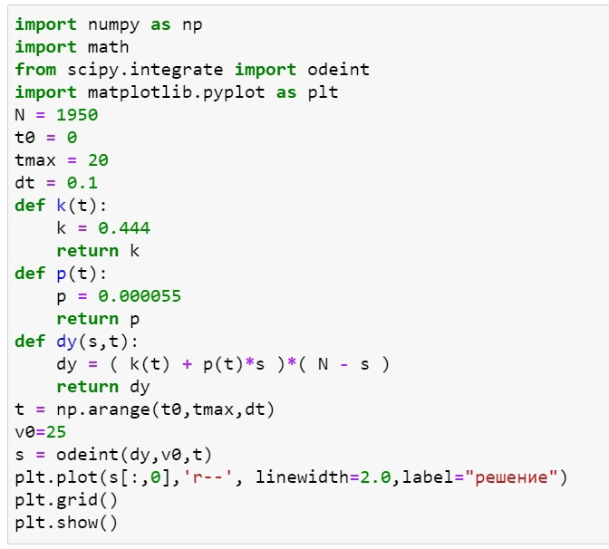
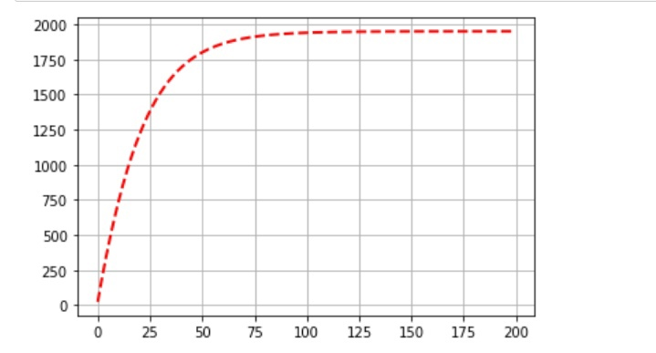

---
# Front matter
lang: ru-RU
title: "Oтчёт по лабораторной работе"
subtitle: "Эффективность рекламы "
author: "Назарьева Алена Игоревна НФИбд-03-18"

# Formatting
toc-title: "Содержание"
toc: true # Table of contents
toc_depth: 2
lof: true # List of figures
lot: true # List of tables
fontsize: 12pt
linestretch: 1.5
papersize: a4paper
documentclass: scrreprt
polyglossia-lang: russian
polyglossia-otherlangs: english
mainfont: PT Serif
romanfont: PT Serif
sansfont: PT Sans
monofont: PT Mono
mainfontoptions: Ligatures=TeX
romanfontoptions: Ligatures=TeX
sansfontoptions: Ligatures=TeX,Scale=MatchLowercase
monofontoptions: Scale=MatchLowercase
indent: true
pdf-engine: lualatex
header-includes:
  - \linepenalty=10 # the penalty added to the badness of each line within a paragraph (no associated penalty node) Increasing the value makes tex try to have fewer lines in the paragraph.
  - \interlinepenalty=0 # value of the penalty (node) added after each line of a paragraph.
  - \hyphenpenalty=50 # the penalty for line breaking at an automatically inserted hyphen
  - \exhyphenpenalty=50 # the penalty for line breaking at an explicit hyphen
  - \binoppenalty=700 # the penalty for breaking a line at a binary operator
  - \relpenalty=500 # the penalty for breaking a line at a relation
  - \clubpenalty=150 # extra penalty for breaking after first line of a paragraph
  - \widowpenalty=150 # extra penalty for breaking before last line of a paragraph
  - \displaywidowpenalty=50 # extra penalty for breaking before last line before a display math
  - \brokenpenalty=100 # extra penalty for page breaking after a hyphenated line
  - \predisplaypenalty=10000 # penalty for breaking before a display
  - \postdisplaypenalty=0 # penalty for breaking after a display
  - \floatingpenalty = 20000 # penalty for splitting an insertion (can only be split footnote in standard LaTeX)
  - \raggedbottom # or \flushbottom
  - \usepackage{float} # keep figures where there are in the text
  - \floatplacement{figure}{H} # keep figures where there are in the text
---

# Цель работы

Изучить и реализовать Эффективность рекламы

# Задание
Постройте график распространения рекламы, математическая модель которой описывается
следующим уравнением:
1.dn/dt = (0.444+0.000055n(t))(N-n(t))
2.dn/dt=(0.000065+0.433n(t))(N-n(t))
3.dn/dt=(0.5cos(12t)+(0.3cos(13t))(N-n(t))
При этом объем аудитории N = 1950, в начальный момент о товаре знает 25 человек. Для случая 2 определите в какой момент времени скорость распространения рекламы будет иметь максимальное значение.

# Теоретическая справка

Организуется рекламная кампания нового товара или услуги. Необходимо,
чтобы прибыль будущих продаж с избытком покрывала издержки на рекламу.
Вначале расходы могут превышать прибыль, поскольку лишь малая часть
потенциальных покупателей будет информирована о новинке. Затем, при
увеличении числа продаж, возрастает и прибыль, и, наконец, наступит момент, когда рынок насытиться, и рекламировать товар станет бесполезным.
Предположим, что торговыми учреждениями реализуется некоторая
продукция, о которой в момент времени tиз числа потенциальных покупателей N знает лишь n покупателей. Для ускорения сбыта продукции запускается реклама
по радио, телевидению и других средств массовой информации. После запуска рекламной кампании информация о продукции начнет распространяться среди потенциальных покупателей путем общения друг с другом. Таким образом, после запуска рекламных объявлений скорость изменения числа знающих о продукции
людей пропорциональна как числу знающих о товаре покупателей, так и числу покупателей о нем не знающих
Модель рекламной кампании описывается следующими величинами.
Считаем, что dn/dt - скорость изменения со временем числа потребителей,
узнавших о товаре и готовых его купить,
t - время, прошедшее с начала рекламной кампании,
n(t) - число уже информированных клиентов. Эта величина
пропорциональна числу покупателей, еще не знающих о нем, это описывается
следующим образом: a1(t)(N-n(t)), где N - общее число потенциальных
платежеспособных покупателей,
a1(t)>0 - характеризует интенсивность
рекламной кампании (зависит от затрат на рекламу в данный момент времени). Помимо этого, узнавшие о товаре потребители также распространяют полученную
информацию среди потенциальных покупателей, не знающих о нем (в этом случае работает т.н. сарафанное радио). Этот вклад в рекламу описывается величиной (a1(t)+a2(t)n(t))(N-n(t)) , эта величина увеличивается с увеличением потребителей узнавших о товаре. Математическая модель распространения рекламы описывается
уравнением:dn/dt=(a1(t)+a2(t)n(t))(N-n(t)) (1)
При a1(t)>>a2(t) получается модель типа модели Мальтуса, решение которой
имеет вид (рис. -@fig:005)

{ #fig:005 width=70% }

В обратном случае, при a1(t)<<a2(t) получаем уравнение логистической
кривой: (рис. -@fig:006)

{ #fig:006 width=70% }

# Выполнение лабораторной работы

1. Код в python для модели (рис. -@fig:001)

{ #fig:001 width=70% }

2. График распространения рекламы, математическая модель которой описывается
следующим уравнением:
dn/dt = (0.444+0.000055n(t))(N-n(t)) (рис. -@fig:002)

{ #fig:002 width=70% }

3.  График распространения рекламы, математическая модель которой описывается
следующим уравнением: dn/dt=(0.000065+0.433n(t))(N-n(t)) (рис. -@fig:003)

{ #fig:003 width=70% }

При t=0.006 и N=1312.57124133 скорость распространения рекламы будет иметь максимальное значение.

4. График распространения рекламы, математическая модель которой описывается
следующим уравнением: dn/dt=(0.5cos(12t)+(0.3cos(13t))(N-n(t)) (рис. -@fig:004)

{ #fig:004 width=70% }

# Выводы

В результате проделанной работы я изучила и реализовала модель эффективности рекламы
